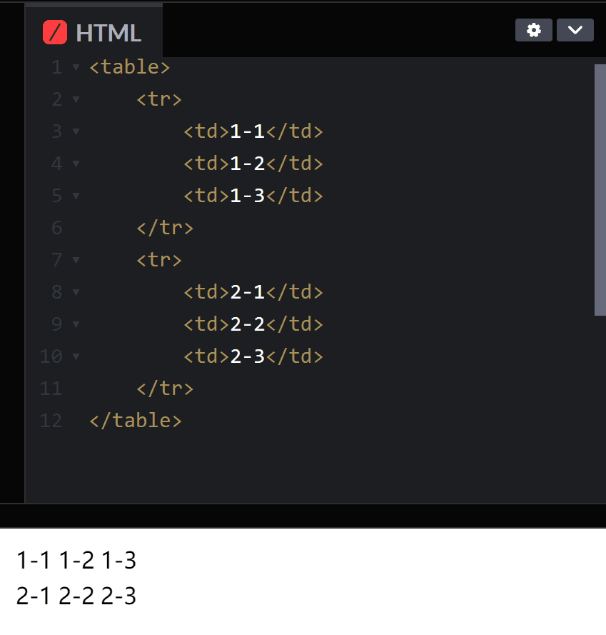

# 2022-12-26

## html
超文本标记语言

## 在线编译器
[codepen](https://codepen.io/pen/)

## 基础知识
1. DOCTYPE:告诉浏览器，要使用什么规范
2. head：表示网页的头部
  - meta：描述性标签，用来描述网站的一些信息
3. title：网页标题
4. body：网页的主体

## 网页基本标签
- 标题标签
`<h1></h1>`, `<h2></h2>`...
- 段落标签
`<p></p>`
- 换行标签
`<br/>`
- 水平线标签
`<hr/>`
- 字体样式标签
粗体：`<strong></strong>`
斜体：`<em></em>`
- 注释和特殊符号
注释：`<!-- -->`
特殊符号：
(写法):与符号开头(&)，英文分号(;)结尾
空格：`&nbsp;`
大于：`&gt;`
小于：`&lt;`

## 图像标签
```html

```

## 超链接标签
```html
<a href="跳转页面"></a>
```

## 列表标签
有序列表
```html
<ol>
    <li></li>
    <li></li>
    <li></li>
</ol>
```
无序列表
```html
<ul>
    <li></li>
    <li></li>
    <li></li>
</ul>
```
自定义列表
- `dl`:标签
- `dt`:列表名称
- `dd`:列表内容
```html
<dl>
    <dt></dt>
    <dd></dd>
    <dd></dd>
    <dd></dd>
</dl>
```

## 表格标签
```html
<table>
    <tr>
        <td>1-1</td>
        <td>1-2</td>
        <td>1-3</td>
    </tr>
    <tr>
        <td>2-1</td>
        <td>2-2</td>
        <td>2-3</td>
    </tr>    
</table>
```
结果:
`一个两行三列的表格`
<br>


## 视频元素和音频元素
- 视频
```html
<video src="path"> <video>
```
- 音频
```html
<audio src="path"></audio>
```

## 页面结构
```html
<header>
    <h2>网页头部</h2>
</header>

<section>
    <h2>网页主体</h2>
</section>

<footer>
    <h2>网页脚部</h2>
</footer>
```
其他
- article:独立的文章内容
- aside:相关内容或者应用（常用于侧边栏）
- nav:导航类辅助内容

## `iframe`内联框架
在网页中嵌套另外一个网页
```html
<iframe src="path" name="mainFrame"> </iframe>
```

## 表单
```html
<form method='POST' action='result.html'>
    <!-- 文本输入框：input -->
    <p> 名字：<input type="text" name="username"> </p>

</form>
```
method:规定如何发送表单数据(GET | POST)
<br>
action:表示向何处发送表单数据，表单提交的位置
<br>
`下拉框:`
```html
<p>
    <select name="">
        <option value="选项的值">中国</option>
    </select>
</p>
```

## 表单的应用
- 隐藏域
- 只读
- 禁用

## 表单的验证
常用方式(输入框中)
- placeholder(提示信息)
- rquired(非空判断)
- pattern(正则表达式)

