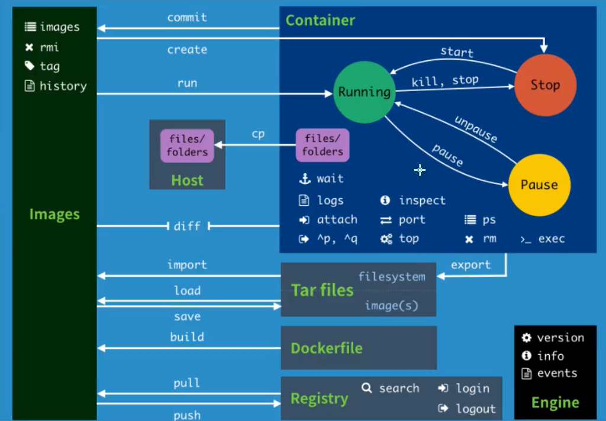
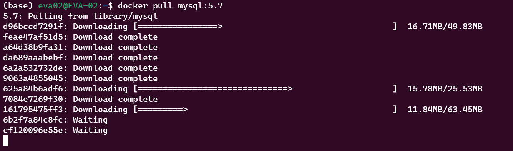
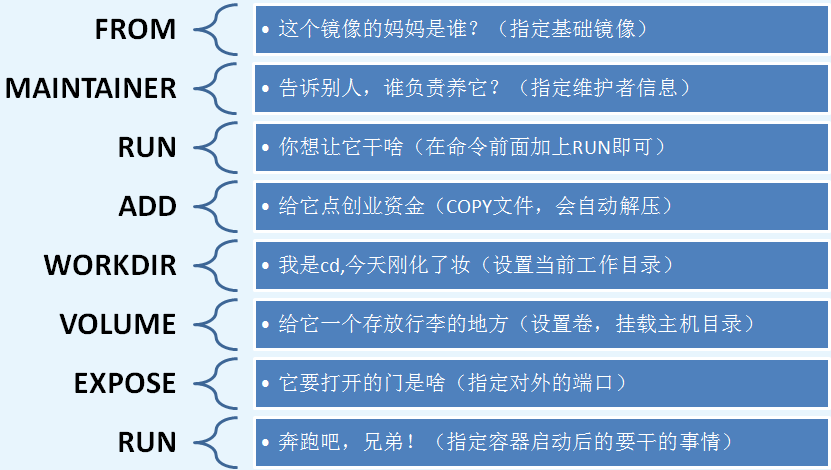

# 2022-12-6

## Docker概述

Docker是一个用于开发，交付和运行应用程序的开放平台。Docker使您能够将应用程序与基础架构分开，从而可以快速交付软件。借助Docker，您可以以与管理应用程序相同的方式来管理基础架构。通过利用Docker的快速交付，测试和部署代码的方法，您可以显着减少编写代码和在生产环境中运行代码之间的延迟。

## Docker架构

Docker使用客户端-服务器架构。Docker*客户端*与Docker*守护进程*进行对话，该*守护进程*完成了构建，运行和分发Docker容器的繁重工作。


## Docker的常用命令

[Docker文档](https://docs.docker.com/)

### 帮助命令

- `docker version`
- `docker info`
- `docker 命令 --help`

### 镜像命令
- `docker images` # 查看所有本地的主机上的镜像
```shell
(base)
25091@EVA-02 MINGW64 ~
$ docker images
REPOSITORY                  TAG       IMAGE ID       CREATED         SIZE
getting-started             latest    920a399a57d2   14 hours ago    255MB
alpine                      latest    49176f190c7e   13 days ago     7.05MB
hooopo/ossinsight-api       latest    8815ada191f1   4 weeks ago     435MB
hooopo/ossinsight-etl       latest    7b535c30ee32   4 weeks ago     575MB
ubuntu                      latest    a8780b506fa4   4 weeks ago     77.8MB
hooopo/ossinsight-fe        latest    7b5eaf84ef84   5 weeks ago     770MB
jimureport-mysql            latest    621e66077737   5 weeks ago     552MB
jimureport                  latest    dc5ec0f279e2   5 weeks ago     245MB
```
- `docker images -aq` # 输出镜像的id

- `docker search`

```shell
(base)
25091@EVA-02 MINGW64 ~
$ docker search mysql
NAME                            DESCRIPTION                                     STARS     OFFICIAL   AUTOMATED
mysql                           MySQL is a widely used, open-source relation…   13560     [OK]
mariadb                         MariaDB Server is a high performing open sou…   5169      [OK]
phpmyadmin                      phpMyAdmin - A web interface for MySQL and M…   699       [OK]
percona                         Percona Server is a fork of the MySQL relati…   596       [OK]
bitnami/mysql                   Bitnami MySQL Docker Image                      79                   [OK]
databack/mysql-backup           Back up mysql databases to... anywhere!         76
```

- `docker pull 下载镜像`
```shell
(base)
25091@EVA-02 MINGW64 ~
$ docker pull mysql:5.7
5.7: Pulling from library/mysql
d96bccd7291f: Pull complete
feae47af51d5: Pull complete
a64d38b9fa31: Pull complete
da689aaabebf: Pull complete
6a2a532732de: Pull complete
9063a4855045: Pull complete
625a84b6adf6: Pull complete
7084e7269f30: Pull complete
161795475ff3: Pull complete
6b2f7a84c8fc: Pull complete
cf120096e55e: Pull complete
Digest: sha256:4149a92977a54d27cbd6f81cca3817e6278a844d566b45f9ff1908bb2714b1ca
Status: Downloaded newer image for mysql:5.7
docker.io/library/mysql:5.7

# 分层下载，联合文件系统
```
`docker pull mysql:5.7`等价于`docker pull docker.io/library/mysql:5.7`

- `docker rmi` 删除镜像
```shell
(base)
25091@EVA-02 MINGW64 ~
$ docker images
REPOSITORY                  TAG       IMAGE ID       CREATED         SIZE
getting-started             latest    920a399a57d2   15 hours ago    255MB
mysql                       5.7       2d44289af685   6 days ago      495MB
alpine                      latest    49176f190c7e   13 days ago     7.05MB
hooopo/ossinsight-api       latest    8815ada191f1   4 weeks ago     435MB
hooopo/ossinsight-etl       latest    7b535c30ee32   4 weeks ago     575MB
ubuntu                      latest    a8780b506fa4   4 weeks ago     77.8MB
hooopo/ossinsight-fe        latest    7b5eaf84ef84   5 weeks ago     770MB
jimureport-mysql            latest    621e66077737   5 weeks ago     552MB
jimureport                  latest    dc5ec0f279e2   5 weeks ago     245MB
my-mysql                    latest    4dd7fcfb9201   6 weeks ago     535MB
mysql                       8.0.31    8fad08b3c84b   6 weeks ago     535MB
mysql                       latest    8fad08b3c84b   6 weeks ago     535MB
alpine/git                  latest    692618a0d74d   3 months ago    43.4MB
confluentinc/cp-kafka       6.2.0     6b8633010002   15 months ago   772MB
confluentinc/cp-zookeeper   6.2.0     3cf98185738a   15 months ago   772MB
(base)
25091@EVA-02 MINGW64 ~
$ docker rmi -f 2d44289af685
Untagged: mysql:5.7
Untagged: mysql@sha256:4149a92977a54d27cbd6f81cca3817e6278a844d566b45f9ff1908bb2714b1ca
Deleted: sha256:2d44289af6858f5d6b118c8d1547679d70b752ec179740785d7452081de8cb31
Deleted: sha256:b7f199c2c682686c334c806114ea1067be32bb2191972d5ce990337b3595b149
Deleted: sha256:041aa3f5ccdd4049568d433702077e9d96ab6e220005b7e38bb9bb63b61a4051
Deleted: sha256:c7684124e2431ccbcd649c1b16764265ddcfdf65195fa82704cd77a2a393caea
Deleted: sha256:0365cbb03a973820460e4a75b79d96b524dfd225eb2c89a71ba61f0750daf056
Deleted: sha256:dbce79d310e9e1de4d4a63f9d3ab0ff63a1e707962c736716bf96f2c0e31ae89
Deleted: sha256:0f5946199c1b458959eaa472d2ec04d6215a4e7a55123f73d35a82a10b934286
Deleted: sha256:0d35381f7619908c581e3afe559dc7c569232a96b782609a786b41cc377b2c33
Deleted: sha256:cc96ccc82821eee81eec502c26d0753a6cbf540a5fd954f48ccf14310f9fab08
Deleted: sha256:22e0c3c2fa92fcaaf5c2a98ce4dc7bf33415d067280c57653fcca571dd26000b
Deleted: sha256:cfb2c429774644e29d13a07f5e8b3b111a4f70c83cc9f519fff2370a48a63efa
Deleted: sha256:e50a0c8c34c94585f04fda2918af1b2bc3e04d1fff9924e7b78fc032ef1c92a6
(base)
25091@EVA-02 MINGW64 ~
$ docker images
REPOSITORY                  TAG       IMAGE ID       CREATED         SIZE
getting-started             latest    920a399a57d2   15 hours ago    255MB
alpine                      latest    49176f190c7e   13 days ago     7.05MB
hooopo/ossinsight-api       latest    8815ada191f1   4 weeks ago     435MB
hooopo/ossinsight-etl       latest    7b535c30ee32   4 weeks ago     575MB
ubuntu                      latest    a8780b506fa4   4 weeks ago     77.8MB
hooopo/ossinsight-fe        latest    7b5eaf84ef84   5 weeks ago     770MB
jimureport-mysql            latest    621e66077737   5 weeks ago     552MB
jimureport                  latest    dc5ec0f279e2   5 weeks ago     245MB
mysql                       8.0.31    8fad08b3c84b   6 weeks ago     535MB
mysql                       latest    8fad08b3c84b   6 weeks ago     535MB
my-mysql                    latest    4dd7fcfb9201   6 weeks ago     535MB
alpine/git                  latest    692618a0d74d   3 months ago    43.4MB
confluentinc/cp-kafka       6.2.0     6b8633010002   15 months ago   772MB
confluentinc/cp-zookeeper   6.2.0     3cf98185738a   15 months ago   772MB
```

### 容器命令
(有镜像才可以创建容器)
下载centos来测试学习
```shell
# 拉取镜像
docker pull centos
# 新建容器并且启动
docker run [可选参数] image
## 参数说明
--name='name' 容器名字，用来区分容器
-d            后台方式运行
-it           使用交互方式运行，进入容器查看内容
-p            指定容器的端口
### 例如
# 运行容器
docker run -it centos
# 退出容器(直接停止容器并且退出)
exit
# 退出容器(容器不停止退出)
Ctrl + P + Q
# 查看运行中的容器
docker ps
# 删除容器
docker rm 容器id # 删除指定的容器，不能删除正在运行的容器
docker rm -f $(docker ps -aq) # 删除所有的容器
docker ps -a -q|xargs docker rm # 删除所有容器
# 启动和停止容器操作
docker start 容器id
docker restart 容器id
docker stop 容器id
dockerskill 容器id
```

## Docker常用其他命令
- 后台启动
`docker run -d cenos`
```shell
docker run -d cenos
# 会发现centos停止了
# 原因：docker容器使用后台运行，就必须要有一个前台进程，docker发现没有应用，就会自动停止
```
- 查看日志
`docker logs 容器id`
```shell
(base)
25091@EVA-02 MINGW64 ~
$ docker logs 5701652e484f
[root@5701652e484f /]# ls
bin  dev  etc  home  lib  lib64  lost+found  media  mnt  opt  proc  root  run  sbin  srv  sys  tmp  usr  var
[root@5701652e484f /]# exit
exit
```
- 查看容器中的进程命令
`docker top 容器id`
```shell
(base)
25091@EVA-02 MINGW64 ~
$ docker ps
CONTAINER ID   IMAGE                          COMMAND                  CREATED          STATUS                         PORTS                               NAMES
0a4c9a989736   centos                         "/bin/bash"              43 seconds ago   Up 42 seconds
                                   wonderful_chatterjee
a4dda0ec73ee   confluentinc/cp-kafka:6.2.0    "/etc/confluent/dock…"   3 weeks ago      Up 2 seconds                   0.0.0.0:9092->9092/tcp              ts-demo-kafka-1
ce48e440668c   hooopo/ossinsight-api:latest   "docker-entrypoint.s…"   4 weeks ago      Up 59 minutes                  0.0.0.0:3450->3450/tcp              ossinsight-api-1
81d1cf0b3c7a   hooopo/ossinsight-etl:latest   "./start.sh"             4 weeks ago      Up 14 seconds
                                   ossinsight-etl-1
ad7a9fa3a0c5   hooopo/ossinsight-fe:latest    "docker-entrypoint.s…"   4 weeks ago      Restarting (1) 6 seconds ago                                       ossinsight-web-1
13aa253beb05   jimureport                     "/bin/sh -c 'java -D…"   5 weeks ago      Up 59 minutes                  0.0.0.0:8085->8085/tcp              jimureport
8b7358828996   jimureport-mysql               "docker-entrypoint.s…"   5 weeks ago      Up 59 minutes                  33060/tcp, 0.0.0.0:3307->3306/tcp   jimureport-mysql
(base)
25091@EVA-02 MINGW64 ~
$ docker top 0a4c9a989736
UID                 PID                 PPID                C                   STIME               TTY
TIME                CMD
root                21148               21128               0                   06:45               ?
00:00:00            /bin/bash
```
- 查看镜像的元数据
`docker inspect 容器id`
```shell
# 测试
(base)
25091@EVA-02 MINGW64 ~
$ docker inspect 0a4c9a989736
[
    {
        "Id": "0a4c9a98973605b2d86cc22b366757a8ab946bfbfa06b9d59f048d1050d4eac4",
        "Created": "2022-12-06T06:45:50.51740711Z",
        "Path": "/bin/bash",
        "Args": [],
        "State": {
            "Status": "running",
            "Running": true,
            "Paused": false,
            "Restarting": false,
            "OOMKilled": false,
            "Dead": false,
            "Pid": 21148,
            "ExitCode": 0,
            "Error": "",
            "StartedAt": "2022-12-06T06:45:50.930498524Z",
            "FinishedAt": "0001-01-01T00:00:00Z"
        },
        "Image": "sha256:5d0da3dc976460b72c77d94c8a1ad043720b0416bfc16c52c45d4847e53fadb6",
        "ResolvConfPath": "/var/lib/docker/containers/0a4c9a98973605b2d86cc22b366757a8ab946bfbfa06b9d59f048d1050d4eac4/resolv.conf",
        "HostnamePath": "/var/lib/docker/containers/0a4c9a98973605b2d86cc22b366757a8ab946bfbfa06b9d59f048d1050d4eac4/hostname",
        "HostsPath": "/var/lib/docker/containers/0a4c9a98973605b2d86cc22b366757a8ab946bfbfa06b9d59f048d1050d4eac4/hosts",
        "LogPath": "/var/lib/docker/containers/0a4c9a98973605b2d86cc22b366757a8ab946bfbfa06b9d59f048d1050d4eac4/0a4c9a98973605b2d86cc22b366757a8ab946bfbfa06b9d59f048d1050d4eac4-json.log",
        "Name": "/wonderful_chatterjee",
        "RestartCount": 0,
        "Driver": "overlay2",
        "Platform": "linux",
        "MountLabel": "",
        "ProcessLabel": "",
        "AppArmorProfile": "",
        "ExecIDs": null,
        "HostConfig": {
            "Binds": null,
            "ContainerIDFile": "",
            "LogConfig": {
                "Type": "json-file",
                "Config": {}
            },
            "NetworkMode": "default",
            "PortBindings": {},
            "RestartPolicy": {
                "Name": "no",
                "MaximumRetryCount": 0
            },
            "AutoRemove": false,
            "VolumeDriver": "",
            "VolumesFrom": null,
            "CapAdd": null,
            "CapDrop": null,
            "CgroupnsMode": "host",
            "Dns": [],
            "DnsOptions": [],
            "DnsSearch": [],
            "ExtraHosts": null,
            "GroupAdd": null,
            "IpcMode": "private",
            "Cgroup": "",
            "Links": null,
            "OomScoreAdj": 0,
            "PidMode": "",
            "Privileged": false,
            "PublishAllPorts": false,
            "ReadonlyRootfs": false,
            "SecurityOpt": null,
            "UTSMode": "",
            "UsernsMode": "",
            "ShmSize": 67108864,
            "Runtime": "runc",
            "ConsoleSize": [
                30,
                120
            ],
            "Isolation": "",
            "CpuShares": 0,
            "Memory": 0,
            "NanoCpus": 0,
            "CgroupParent": "",
            "BlkioWeight": 0,
            "BlkioWeightDevice": [],
            "BlkioDeviceReadBps": null,
            "BlkioDeviceWriteBps": null,
            "BlkioDeviceReadIOps": null,
            "BlkioDeviceWriteIOps": null,
            "CpuPeriod": 0,
            "CpuQuota": 0,
            "CpuRealtimePeriod": 0,
            "CpuRealtimeRuntime": 0,
            "CpusetCpus": "",
            "CpusetMems": "",
            "Devices": [],
            "DeviceCgroupRules": null,
            "DeviceRequests": null,
            "KernelMemory": 0,
            "KernelMemoryTCP": 0,
            "MemoryReservation": 0,
            "MemorySwap": 0,
            "MemorySwappiness": null,
            "OomKillDisable": false,
            "PidsLimit": null,
            "Ulimits": null,
            "CpuCount": 0,
            "CpuPercent": 0,
            "IOMaximumIOps": 0,
            "IOMaximumBandwidth": 0,
            "MaskedPaths": [
                "/proc/asound",
                "/proc/acpi",
                "/proc/kcore",
                "/proc/keys",
                "/proc/latency_stats",
                "/proc/timer_list",
                "/proc/timer_stats",
                "/proc/sched_debug",
                "/proc/scsi",
                "/sys/firmware"
            ],
            "ReadonlyPaths": [
                "/proc/bus",
                "/proc/fs",
                "/proc/irq",
                "/proc/sys",
                "/proc/sysrq-trigger"
            ]
        },
        "GraphDriver": {
            "Data": {
                "LowerDir": "/var/lib/docker/overlay2/2ad5156364e50be40f3889e7a0264b665038f94715764af861040ff3e71634e5-init/diff:/var/lib/docker/overlay2/aa5dad1ca76ed31a0b98ca04ff51baebdd24fc4e8215819cc2974378caafe67d/diff",
                "MergedDir": "/var/lib/docker/overlay2/2ad5156364e50be40f3889e7a0264b665038f94715764af861040ff3e71634e5/merged",
                "UpperDir": "/var/lib/docker/overlay2/2ad5156364e50be40f3889e7a0264b665038f94715764af861040ff3e71634e5/diff",
                "WorkDir": "/var/lib/docker/overlay2/2ad5156364e50be40f3889e7a0264b665038f94715764af861040ff3e71634e5/work"
            },
            "Name": "overlay2"
        },
        "Mounts": [],
        "Config": {
            "Hostname": "0a4c9a989736",
            "Domainname": "",
            "User": "",
            "AttachStdin": true,
            "AttachStdout": true,
            "AttachStderr": true,
            "Tty": true,
            "OpenStdin": true,
            "StdinOnce": true,
            "Env": [
                "PATH=/usr/local/sbin:/usr/local/bin:/usr/sbin:/usr/bin:/sbin:/bin"
            ],
            "Cmd": [
                "/bin/bash"
            ],
            "Image": "centos",
            "Volumes": null,
            "WorkingDir": "",
            "Entrypoint": null,
            "OnBuild": null,
            "Labels": {
                "org.label-schema.build-date": "20210915",
                "org.label-schema.license": "GPLv2",
                "org.label-schema.name": "CentOS Base Image",
                "org.label-schema.schema-version": "1.0",
                "org.label-schema.vendor": "CentOS"
            }
        },
        "NetworkSettings": {
            "Bridge": "",
            "SandboxID": "84bf9e4ee8e1ceee4b7c7c3f7fd6d81bdeffbb38d9c9bcdb97bfb5e5158cb5bb",
            "HairpinMode": false,
            "LinkLocalIPv6Address": "",
            "LinkLocalIPv6PrefixLen": 0,
            "Ports": {},
            "SandboxKey": "/var/run/docker/netns/84bf9e4ee8e1",
            "SecondaryIPAddresses": null,
            "SecondaryIPv6Addresses": null,
            "EndpointID": "4884319e5fa2a073cab57a9f32fbb2ab3a8f724cbae90bd7273e6777fe308fb2",
            "Gateway": "172.17.0.1",
            "GlobalIPv6Address": "",
            "GlobalIPv6PrefixLen": 0,
            "IPAddress": "172.17.0.2",
            "IPPrefixLen": 16,
            "IPv6Gateway": "",
            "MacAddress": "02:42:ac:11:00:02",
            "Networks": {
                "bridge": {
                    "IPAMConfig": null,
                    "Links": null,
                    "Aliases": null,
                    "NetworkID": "60b317fba0892f38de9a05e76a03289002e6a6af7d931ac3b520f9ed080bc7d7",
                    "EndpointID": "4884319e5fa2a073cab57a9f32fbb2ab3a8f724cbae90bd7273e6777fe308fb2",
                    "Gateway": "172.17.0.1",
                    "IPAddress": "172.17.0.2",
                    "IPPrefixLen": 16,
                    "IPv6Gateway": "",
                    "GlobalIPv6Address": "",
                    "GlobalIPv6PrefixLen": 0,
                    "MacAddress": "02:42:ac:11:00:02",
                    "DriverOpts": null
                }
            }
        }
    }
]
```
- 进入当前正在运行的容器
`docker exec -it 容器id`
```shell
# WSL2
# 法一
(base) eva02@EVA-02:~$ docker exec -it 0a4c9a989736 /bin/bash
[root@0a4c9a989736 /]# exit
exit
(base) eva02@EVA-02:~$
```
​      `docker attach 容器id`
```shell
# 法二
(base) eva02@EVA-02:~$ docker attach 0a4c9a989736
[root@0a4c9a989736 /]# exit
exit
(base) eva02@EVA-02:~$

## 区别
exec 进入容器后开启一个新的终端，可以在里面操作
attach 进入容器正在执行的终端，不会启动新的进程
```
- 从容器内拷贝文件到主机上
`docker cp 容器id：镜像文件路径 主机目标路径`
```shell
(base) eva02@EVA-02:~$ docker run -it centos
[root@85770a2d4205 /]# ls
bin  dev  etc  home  lib  lib64  lost+found  media  mnt  opt  proc  root  run  sbin  srv  sys  tmp  usr  var
[root@85770a2d4205 /]# cd ./home/
[root@85770a2d4205 home]# ls
[root@85770a2d4205 home]# touch test
[root@85770a2d4205 home]# ls
test
[root@85770a2d4205 home]# rm test
rm: remove regular empty file 'test'? y
[root@85770a2d4205 home]# ls
[root@85770a2d4205 home]# touch test.sh
[root@85770a2d4205 home]# ls
test.sh
[root@85770a2d4205 home]# exit
exit
(base) eva02@EVA-02:~$ docker ps -a
CONTAINER ID   IMAGE                             COMMAND                  CREATED          STATUS
          PORTS                               NAMES
85770a2d4205   centos                            "/bin/bash"              2 minutes ago    Exited (0) 2 minutes ago                                           optimistic_brown
0a4c9a989736   centos                            "/bin/bash"              29 minutes ago   Exited (0) 11 minutes ago                                          wonderful_chatterjee
5701652e484f   centos                            "/bin/bash"              57 minutes ago   Exited (0) 57 minutes ago                                          heuristic_turing
fa38be0229ee   centos                            "C:/Program Files/Gi…"   58 minutes ago   Created
                                              hopeful_hofstadter
ed60dd52e0ee   centos                            "C:/Program Files/Gi…"   58 minutes ago   Created
                                              hopeful_moser
c180d9a5055f   getting-started                   "docker-entrypoint.s…"   16 hours ago     Exited (0) 16 hours ago                                            elegant_chaplygin
a4dda0ec73ee   confluentinc/cp-kafka:6.2.0       "/etc/confluent/dock…"   3 weeks ago      Up 14 seconds                  0.0.0.0:9092->9092/tcp              ts-demo-kafka-1
b66792becdb4   confluentinc/cp-zookeeper:6.2.0   "/etc/confluent/dock…"   3 weeks ago      Exited (143) 2 weeks ago                                           ts-demo-zookeeper-1
ce48e440668c   hooopo/ossinsight-api:latest      "docker-entrypoint.s…"   4 weeks ago      Up About an hour               0.0.0.0:3450->3450/tcp              ossinsight-api-1
81d1cf0b3c7a   hooopo/ossinsight-etl:latest      "./start.sh"             4 weeks ago      Up 13 seconds                                                      ossinsight-etl-1
ad7a9fa3a0c5   hooopo/ossinsight-fe:latest       "docker-entrypoint.s…"   4 weeks ago      Restarting (1) 2 seconds ago                                       ossinsight-web-1
cdc6c70f969e   mysql                             "docker-entrypoint.s…"   5 weeks ago      Exited (0) 5 weeks ago                                             my-mysql
de19928bb6f6   my-mysql                          "docker-entrypoint.s…"   5 weeks ago      Exited (0) 5 weeks ago                                             focused_kilby
13aa253beb05   jimureport                        "/bin/sh -c 'java -D…"   5 weeks ago      Up About an hour               0.0.0.0:8085->8085/tcp              jimureport
8b7358828996   jimureport-mysql                  "docker-entrypoint.s…"   5 weeks ago      Up About an hour               33060/tcp, 0.0.0.0:3307->3306/tcp   jimureport-mysql
(base) eva02@EVA-02:~$ docker cp 85770a2d4205:/home/test.sh ~
(base) eva02@EVA-02:~$ ls
anaconda3  github.com  test.sh  tidb-course-201-lab
(base) eva02@EVA-02:~$
```

## Docker命令图


## Docker镜像

### 什么是镜像

镜像是一种轻量级、可执行的独立软件包，用来打包软件运行环境的软件

所有应用，直接打包`docker`镜像，就可以直接跑起来！

如何得到镜像：

- 从远程仓库下载
- 朋友拷贝给你
- 自己制作一个`dockerfile`

### Docker镜像加载原理

> UnionFS (联合文件系统)

`UnionFS`是一种分层、轻量级并且高性能的文件系统，它支持对文件系统的修改作为一次提交来一层层的叠加，同时可以将不同目录挂载到同一个虚拟文件系统下(unite several directories into a single virtual filesystem)。`Union`文件系统是docker镜像的基础。

特性：

- 一次同时加载多个文件系统，但是从外面看来，只能看到一个文件系统，联合加载会把各层文件系统叠加起来，这样最终的文件系统会同时包含所有低层的文件和目录

> docker镜像加载原理

`docker的镜像`实际上由一层层的文件系统组成，这种层级的文件系统`UnionFS`。


### 分层理解

> 分层的镜像

我们下载一个镜像，会发现，它其实是在一层一层的下载



分层下载的好处：

- 资源共享，没必要每次都要下载全部层

所有的docker镜像都起源于一个层，当进行修改或者增加新的内容时，就会在当前的镜像层上，创建新的一层。

> 特点

docker镜像都是只读的，当容器启动的时候，一个新的可写层被加载到镜像的顶端！

这一层就是我们通常说的`容器层`，容器之下的都叫`镜像层`。

### 提交镜像

- `docker commit` # 提交容器成为一个新的副本

```shell
docker commit -m='提交的描述信息' -a='作者' 容器id 目标镜像名 [TAG]
```

例子：

```shell
# 启动一个镜像
(base) eva02@EVA-02:~$ docker run -it centos

# 在home文件夹新建一个hello.py
[root@6ab1534b7c27 /]# ls
bin  dev  etc  home  lib  lib64  lost+found  media  mnt  opt  proc  root  run  sbin  srv  sys  tmp  usr  var
[root@6ab1534b7c27 /]# cd ./home/
[root@6ab1534b7c27 home]# ls
[root@6ab1534b7c27 home]# touch hello.py
[root@6ab1534b7c27 home]# vim hello.py
bash: vim: command not found
[root@6ab1534b7c27 home]# vi hello.py
[root@6ab1534b7c27 home]# ls
hello.py

# 用ctrl + P + Q退出
# 保证这个容器在运行
[root@7c394fe467aa home]# (base) eva02@EVA-02:~$ docker ps
CONTAINER ID   IMAGE                          COMMAND                  CREATED         STATUS
  PORTS                               NAMES
7c394fe467aa   centos                         "/bin/bash"              2 minutes ago   Up 2 minutes
                                      charming_wozniak
a4dda0ec73ee   confluentinc/cp-kafka:6.2.0    "/etc/confluent/dock…"   3 weeks ago     Up 34 seconds
  0.0.0.0:9092->9092/tcp              ts-demo-kafka-1
ce48e440668c   hooopo/ossinsight-api:latest   "docker-entrypoint.s…"   4 weeks ago     Up 6 hours
  0.0.0.0:3450->3450/tcp              ossinsight-api-1
81d1cf0b3c7a   hooopo/ossinsight-etl:latest   "./start.sh"             4 weeks ago     Up 10 seconds
                                      ossinsight-etl-1
ad7a9fa3a0c5   hooopo/ossinsight-fe:latest    "docker-entrypoint.s…"   4 weeks ago     Restarting (1) 34 seconds ago                                       ossinsight-web-1
13aa253beb05   jimureport                     "/bin/sh -c 'java -D…"   6 weeks ago     Up 6 hours
  0.0.0.0:8085->8085/tcp              jimureport
8b7358828996   jimureport-mysql               "docker-entrypoint.s…"   6 weeks ago     Up 6 hours
  33060/tcp, 0.0.0.0:3307->3306/tcp   jimureport-mysql
  
# 提交镜像
(base) eva02@EVA-02:~$ docker commit -m='add hello.py' -a='w' 7c394fe467aa cetos02:1.0
sha256:51ba38925061003cf5514f61248754c44de204ee6381646e85aad9377bc7f14f

# 查看提交结果
(base) eva02@EVA-02:~$ docker images
REPOSITORY                  TAG       IMAGE ID       CREATED         SIZE
cetos02                     1.0       51ba38925061   5 minutes ago   231MB
centos                      latest    5d0da3dc9764   14 months ago   231MB
## 文件大小没变的原因是因为一个hello.py文件过于小
```

## 容器数据卷

### 什么是数据容器卷

Docker将应用和环境打包成一个镜像。

数据？如果数据都在容器中，那么，容器删除了了，那么数据就会丢失了。

**需求：数据可以持久化**

容器之间有一个数据共享的技术，那么Docker容器中的数据就可以同步到本地！

这个技术就是卷技术，也就是目录的挂载。

总结：

<mark>容器的持久化和同步操作，容器间也是可以数据共享的！</mark>

### 使用数据卷

> 方式一

- 使用`-v`

`docker run -it -v 主机目录:容器内目录 镜像名`

```shell
(base) eva02@EVA-02:~$ ls
anaconda3  github.com  tidb-course-201-lab
(base) eva02@EVA-02:~$ docker run -it -v ~/test:/home centos
[root@18f0b96472a6 /]# ls
bin  dev  etc  home  lib  lib64  lost+found  media  mnt  opt  proc  root  run  sbin  srv  sys  tmp  usr  var
[root@18f0b96472a6 /]# cd ./home
[root@18f0b96472a6 home]# (base) eva02@EVA-02:~$ ls
anaconda3  github.com  test  tidb-course-201-lab
(base) eva02@EVA-02:~$ cd ./test
(base) eva02@EVA-02:~/test$ ls
(base) eva02@EVA-02:~/test$ docker inspect 18f0b96472a6
## 截取了主要内容
 "Mounts": [
            {
                "Type": "bind",
                "Source": "/home/eva02/test",
                "Destination": "/home",
                "Mode": "",
                "RW": true,
                "Propagation": "rprivate"
            }
        ]
```

**效果**

```shell
(base) eva02@EVA-02:~/test$ docker run -it -v ~/test:/home centos
[root@805d4a4d9e2f /]# ls
bin  dev  etc  home  lib  lib64  lost+found  media  mnt  opt  proc  root  run  sbin  srv  sys  tmp  usr  var
[root@805d4a4d9e2f /]# cd ./home
[root@805d4a4d9e2f home]# ls
[root@805d4a4d9e2f home]# touch test.py
[root@805d4a4d9e2f home]# ls
test.py
[root@805d4a4d9e2f home]# (base) eva02@EVA-02:~/test$ ls
test.py
(base) eva02@EVA-02:~/test$docker ps
CONTAINER ID   IMAGE                          COMMAND                  CREATED         STATUS                          PORTS                               NAMES
805d4a4d9e2f   centos                         "/bin/bash"              8 minutes ago   Up 8 minutes                                                        vibrant_cori
(base) eva02@EVA-02:~/test$ docker attach 805d4a4d9e2f
[root@805d4a4d9e2f home]# ls
test.py
[root@805d4a4d9e2f home]# vim test.py
bash: vim: command not found
[root@805d4a4d9e2f home]# vi test.py
# 在此输入print('hello docker world!')
[root@805d4a4d9e2f home]# read escape sequence
(base) eva02@EVA-02:~/test$ ls
test.py
(base) eva02@EVA-02:~/test$ vim test.py
# 可以看到print('hello docker world!')
# 测试成功！
(base) eva02@EVA-02:~/test$
```

### 具名挂载和匿名挂载

#### 匿名挂载

- -v 容器内路径

```shell
docker run -d -p --name nginx01 -v /ect/nginx nginx

(base) eva02@EVA-02:~$ docker run --name nginx01 -v /ect/nginx nginx
/docker-entrypoint.sh: /docker-entrypoint.d/ is not empty, will attempt to perform configuration
/docker-entrypoint.sh: Looking for shell scripts in /docker-entrypoint.d/
/docker-entrypoint.sh: Launching /docker-entrypoint.d/10-listen-on-ipv6-by-default.sh
10-listen-on-ipv6-by-default.sh: info: Getting the checksum of /etc/nginx/conf.d/default.conf
10-listen-on-ipv6-by-default.sh: info: Enabled listen on IPv6 in /etc/nginx/conf.d/default.conf
/docker-entrypoint.sh: Launching /docker-entrypoint.d/20-envsubst-on-templates.sh
/docker-entrypoint.sh: Launching /docker-entrypoint.d/30-tune-worker-processes.sh
/docker-entrypoint.sh: Configuration complete; ready for start up
2022/12/07 12:11:48 [notice] 1#1: using the "epoll" event method
2022/12/07 12:11:48 [notice] 1#1: nginx/1.23.2
2022/12/07 12:11:48 [notice] 1#1: built by gcc 10.2.1 20210110 (Debian 10.2.1-6)
2022/12/07 12:11:48 [notice] 1#1: OS: Linux 5.15.74.2-microsoft-standard-WSL2
2022/12/07 12:11:48 [notice] 1#1: getrlimit(RLIMIT_NOFILE): 1048576:1048576
2022/12/07 12:11:48 [notice] 1#1: start worker processes
2022/12/07 12:11:48 [notice] 1#1: start worker process 29
2022/12/07 12:11:48 [notice] 1#1: start worker process 30
2022/12/07 12:11:48 [notice] 1#1: start worker process 31
2022/12/07 12:11:48 [notice] 1#1: start worker process 32
2022/12/07 12:11:48 [notice] 1#1: start worker process 33
2022/12/07 12:11:48 [notice] 1#1: start worker process 34
2022/12/07 12:11:48 [notice] 1#1: start worker process 35
2022/12/07 12:11:48 [notice] 1#1: start worker process 36
2022/12/07 12:11:48 [notice] 1#1: start worker process 37
2022/12/07 12:11:48 [notice] 1#1: start worker process 38
2022/12/07 12:11:48 [notice] 1#1: start worker process 39
2022/12/07 12:11:48 [notice] 1#1: start worker process 40
2022/12/07 12:11:48 [notice] 1#1: start worker process 41
2022/12/07 12:11:48 [notice] 1#1: start worker process 42
2022/12/07 12:11:48 [notice] 1#1: start worker process 43
2022/12/07 12:11:48 [notice] 1#1: start worker process 44


# 查看所有的 volume 的情况
(base) eva02@EVA-02:~$ docker volume ls
DRIVER    VOLUME NAME
local     1a7224f3b654c07e76c98fbb40f0ac50c167034b4d8f7603dad840416e4b30d8
local     8f23ebc96b1aa996334dc520d3127f7243a2a1e0c6a28b11065a12b1fc9a88a6
local     29c63d9691ede3a6d8702b332a1205f401e90f243a6975079d8044d74e926572
local     86df5743e874a0b1dfbdf65bc5716e436cce7d6c04aaea5da631e57f845e4dc0
local     276dd46ec7a7b893d14397a7f741b15d0a4001ae990936ae2805d7f1bacd46f2
local     216406d84ab9321669db33ed53066e9feeded1ea913a2c6c8d63bb5a969cf141
local     d2f400d2a4eecd74af1fbe42ea75714f6304c442fd21ca3fae8ec5d3a6f5c438
local     f9d8efb6b95f1e05a281fffa3d2fea836471fa0a7b51a649cb0004e5f8caeb87
local     f674cebaf2f2dd7f45df38cca8b72edd2ceb3938a4492939c4d456f410064d91
local     ossinsight_docusaurus
local     ossinsight_node_modules
local     ossinsight_prefetch
```

匿名挂载：

<mark>local f674cebaf2f2dd7f45df38cca8b72edd2ceb3938a4492939c4d456f410064d91</mark>

#### 具名挂载

- -v 卷名:容器内路径

```shell
docker run -d -P --name nginx02 -v juming-nginx:/etc/nginx nginx

(base) eva02@EVA-02:~$ docker run -d -P --name nginx02 -v juming-nginx:/etc/nginx nginx
9c55b0a0c1f643dff3514311d86fbb3b86475c1fdb234dae33e2298348ff9abd
(base) eva02@EVA-02:~$ docker volume ls
local     juming-nginx
(base) eva02@EVA-02:~$
```

具名挂载：

<mark>local     juming-nginx</mark>

### 数据卷容器

多个容器之间实现数据共享

- `docker run`命令中的`volumes-from`这个参数

```shell
(base) eva02@EVA-02:~$ docker run -it --name centosv1 -v /home 51ba38925061
[root@dcbdccc50af1 /]# ls -la
total 56
drwxr-xr-x   1 root root 4096 Dec  8 00:27 .
drwxr-xr-x   1 root root 4096 Dec  8 00:27 ..
-rwxr-xr-x   1 root root    0 Dec  8 00:27 .dockerenv
lrwxrwxrwx   1 root root    7 Nov  3  2020 bin -> usr/bin
drwxr-xr-x   5 root root  360 Dec  8 00:27 dev
drwxr-xr-x   1 root root 4096 Dec  8 00:27 etc
drwxr-xr-x   2 root root 4096 Dec  8 00:27 home
lrwxrwxrwx   1 root root    7 Nov  3  2020 lib -> usr/lib
lrwxrwxrwx   1 root root    9 Nov  3  2020 lib64 -> usr/lib64
drwx------   2 root root 4096 Sep 15  2021 lost+found
drwxr-xr-x   2 root root 4096 Nov  3  2020 media
drwxr-xr-x   2 root root 4096 Nov  3  2020 mnt
drwxr-xr-x   2 root root 4096 Nov  3  2020 opt
dr-xr-xr-x 392 root root    0 Dec  8 00:27 proc
dr-xr-x---   2 root root 4096 Sep 15  2021 root
drwxr-xr-x  11 root root 4096 Sep 15  2021 run
lrwxrwxrwx   1 root root    8 Nov  3  2020 sbin -> usr/sbin
drwxr-xr-x   2 root root 4096 Nov  3  2020 srv
dr-xr-xr-x  11 root root    0 Dec  8 00:27 sys
drwxrwxrwt   7 root root 4096 Sep 15  2021 tmp
drwxr-xr-x  12 root root 4096 Sep 15  2021 usr
drwxr-xr-x  20 root root 4096 Sep 15  2021 var
[root@dcbdccc50af1 /]# cd ./home/
[root@dcbdccc50af1 home]# ls
hello.py
[root@dcbdccc50af1 home]# (base) eva02@EVA-02:~$ ls
```

```shell
(base) eva02@EVA-02:~$ docker run -it --name centosv2 --volumes-from centosv1 51ba38925061
[root@cbc34a4244aa /]# ls -la
total 56
drwxr-xr-x   1 root root 4096 Dec  8 00:31 .
drwxr-xr-x   1 root root 4096 Dec  8 00:31 ..
-rwxr-xr-x   1 root root    0 Dec  8 00:31 .dockerenv
lrwxrwxrwx   1 root root    7 Nov  3  2020 bin -> usr/bin
drwxr-xr-x   5 root root  360 Dec  8 00:31 dev
drwxr-xr-x   1 root root 4096 Dec  8 00:31 etc
drwxr-xr-x   2 root root 4096 Dec  8 00:27 home
lrwxrwxrwx   1 root root    7 Nov  3  2020 lib -> usr/lib
lrwxrwxrwx   1 root root    9 Nov  3  2020 lib64 -> usr/lib64
drwx------   2 root root 4096 Sep 15  2021 lost+found
drwxr-xr-x   2 root root 4096 Nov  3  2020 media
drwxr-xr-x   2 root root 4096 Nov  3  2020 mnt
drwxr-xr-x   2 root root 4096 Nov  3  2020 opt
dr-xr-xr-x 398 root root    0 Dec  8 00:31 proc
dr-xr-x---   2 root root 4096 Sep 15  2021 root
drwxr-xr-x  11 root root 4096 Sep 15  2021 run
lrwxrwxrwx   1 root root    8 Nov  3  2020 sbin -> usr/sbin
drwxr-xr-x   2 root root 4096 Nov  3  2020 srv
dr-xr-xr-x  11 root root    0 Dec  8 00:31 sys
drwxrwxrwt   7 root root 4096 Sep 15  2021 tmp
drwxr-xr-x  12 root root 4096 Sep 15  2021 usr
drwxr-xr-x  20 root root 4096 Sep 15  2021 var
[root@cbc34a4244aa /]# cd ./home/
[root@cbc34a4244aa home]# ls
hello.py
[root@cbc34a4244aa home]# (base) eva02@EVA-02:~$
```

<mark>可以看到hello.py文件被共享了</mark>

```shell
(base) eva02@EVA-02:~$ docker ps
CONTAINER ID   IMAGE                          COMMAND                  CREATED         STATUS
       PORTS                               NAMES
cbc34a4244aa   51ba38925061                   "/bin/bash"              3 minutes ago   Up 3 minutes
                                           centosv2
dcbdccc50af1   51ba38925061                   "/bin/bash"              7 minutes ago   Up 7 minutes
                                           centosv1
a4dda0ec73ee   confluentinc/cp-kafka:6.2.0    "/etc/confluent/dock…"   3 weeks ago     Up 28 seconds
       0.0.0.0:9092->9092/tcp              ts-demo-kafka-1
ce48e440668c   hooopo/ossinsight-api:latest   "docker-entrypoint.s…"   4 weeks ago     Up 17 minutes
       0.0.0.0:3450->3450/tcp              ossinsight-api-1
81d1cf0b3c7a   hooopo/ossinsight-etl:latest   "./start.sh"             4 weeks ago     Up 13 minutes
                                           ossinsight-etl-1
ad7a9fa3a0c5   hooopo/ossinsight-fe:latest    "docker-entrypoint.s…"   4 weeks ago     Restarting (1) 51 seconds ago                                       ossinsight-web-1
13aa253beb05   jimureport                     "/bin/sh -c 'java -D…"   6 weeks ago     Up 17 minutes
       0.0.0.0:8085->8085/tcp              jimureport
8b7358828996   jimureport-mysql               "docker-entrypoint.s…"   6 weeks ago     Up 17 minutes
       33060/tcp, 0.0.0.0:3307->3306/tcp   jimureport-mysql
(base) eva02@EVA-02:~$ docker attach dcbdccc50af1
[root@dcbdccc50af1 home]# ls
hello.py
[root@dcbdccc50af1 home]# touch hello_world.py
[root@dcbdccc50af1 home]# ls
hello.py  hello_world.py
[root@dcbdccc50af1 home]# read escape sequence
(base) eva02@EVA-02:~$ docker attach cbc34a4244aa
[root@cbc34a4244aa home]# ls
hello.py  hello_world.py
[root@cbc34a4244aa home]# read escape sequence
(base) eva02@EVA-02:~$
```

<mark>再次证明数据卷容器被共享了</mark>

## Dockerfile

### 初识Dockerfile

1. 在一个文件夹中建立一个`dockerfile`文件

```shell
(base) eva02@EVA-02:~/test$ sudo vim dockerfile1
[sudo] password for eva02:
(base) eva02@EVA-02:~/test$ ls
dockerfile1  test.py
(base) eva02@EVA-02:~/test$ cat dockerfile1
FROM centos

VOLUME ["volume01", "volume02"]

CMD echo "----end----"
CMD /bin/bash
```

2. 用`docker build`命令来创建一个镜像

```shell
(base) eva02@EVA-02:~/test$ docker build -f ./dockerfile1 -t eva02/centos .
[+] Building 0.2s (5/5) FINISHED
 => [internal] load build definition from dockerfile1                                                      0.1s
 => => transferring dockerfile: 122B                                                                       0.0s
 => [internal] load .dockerignore                                                                          0.1s
 => => transferring context: 2B                                                                            0.0s
 => [internal] load metadata for docker.io/library/centos:latest                                           0.0s
 => [1/1] FROM docker.io/library/centos                                                                    0.0s
 => exporting to image                                                                                     0.0s
 => => exporting layers                                                                                    0.0s
 => => writing image sha256:bcb7b9d022595d87e4f374a55119c8e2e4933dd784edc7ca0ca447c4d8abff2f               0.0s
 => => naming to docker.io/eva02/centos                                                                    0.0s

Use 'docker scan' to run Snyk tests against images to find vulnerabilities and learn how to fix them
(base) eva02@EVA-02:~/test$ docker images
REPOSITORY                  TAG       IMAGE ID       CREATED         SIZE
eva02/centos                latest    bcb7b9d02259   14 months ago   231MB
```

<mark>这种也是挂载数据卷的一种方式！</mark>

### 基础知识

`Dockerfile` : 构建文件，定义了一切步骤、源代码

`DockerImages` : 通过`Dcokerfile`构建生成的镜像，最终发布和运行的产品

Docker容器 : 镜像运行起来，提供服务

`基本规则` :

1. 每个保留关键词都是大写
2. 执行顺序从上到下
3. `#` 表示注释
4. 每个指令都会创建提交一个新的镜像层，并提交

### Dockerfile构建步骤

1. 编写一个`dockerfile` 文件
2. `docker build` 构建一个成为一个镜像
3. `docker run` 运行镜像
4. `docker push` 发布镜像

### Dockerfile的指令



`常用补充` :

```shell
CMD # 指定这个容器启动的时候要运行的命令，只有最后一个会生效，可被替代
ENTRYPOINT # 指定这个容器启动的时侯要运行的命令，可以追加命令
ONBUILD # 当构建一个被继承的 Dockerfile 这个时候就会运行，触发指令
COPY # 类似ADD，将文件拷贝到镜像中
ENV # 构建的时候设置环境变量
```

### Docker流程小结


## Docker网络

### 理解网络-Docker0

docker0普通的Linux网桥，它是可以在上面配置ip的，可以认为其内部有一个可以用于配置ip信息的网卡接口

#### Docker0

1. 新建一个网络

```shell
docker network create -d bridge my-net
```

2. 连接容器

```shell
docker run -it --rm --name busybox1 --network my-net busybox sh
```

3. 打开新终端，再运行一个容器并且加入到`my-net`网络

```shell
docker run -it --rm --name busybox2 --network my-net busybox sh
```

4. 再次打开一个新的终端查看容器信息

```shell
(base) eva02@EVA-02:~$ docker container ls
CONTAINER ID   IMAGE                          COMMAND                  CREATED          STATUS                          PORTS                               NAMES
e8372dd7ca47   busybox                        "sh"                     17 seconds ago   Up 16 seconds                                                       busybox2
a3b7da84e5f4   busybox                        "sh"                     42 seconds ago   Up 41 seconds                                                       busybox1
```

5. 可以通过`ping`来测试

- `busybox1`

```shell
(base) eva02@EVA-02:~$ docker run -it --rm --name busybox1 --network my-net busybox sh
Unable to find image 'busybox:latest' locally
latest: Pulling from library/busybox
45a0cdc5c8d3: Pull complete
Digest: sha256:3b3128d9df6bbbcc92e2358e596c9fbd722a437a62bafbc51607970e9e3b8869
Status: Downloaded newer image for busybox:latest
/ # ping busybox1
PING busybox1 (172.21.0.2): 56 data bytes
64 bytes from 172.21.0.2: seq=0 ttl=64 time=0.072 ms
64 bytes from 172.21.0.2: seq=1 ttl=64 time=0.099 ms
64 bytes from 172.21.0.2: seq=2 ttl=64 time=0.098 ms
64 bytes from 172.21.0.2: seq=3 ttl=64 time=0.069 ms
64 bytes from 172.21.0.2: seq=4 ttl=64 time=0.079 ms
^C
--- busybox1 ping statistics ---
5 packets transmitted, 5 packets received, 0% packet loss
round-trip min/avg/max = 0.069/0.083/0.099 ms
/ # ping busybox2
PING busybox2 (172.21.0.3): 56 data bytes
64 bytes from 172.21.0.3: seq=0 ttl=64 time=0.097 ms
64 bytes from 172.21.0.3: seq=1 ttl=64 time=0.129 ms
64 bytes from 172.21.0.3: seq=2 ttl=64 time=0.159 ms
64 bytes from 172.21.0.3: seq=3 ttl=64 time=0.158 ms
64 bytes from 172.21.0.3: seq=4 ttl=64 time=0.138 ms
^C
--- busybox2 ping statistics ---
5 packets transmitted, 5 packets received, 0% packet loss
round-trip min/avg/max = 0.097/0.136/0.159 ms
/ #
```

- `busybox2`

```shell
(base) eva02@EVA-02:~$ docker run -it --rm --name busybox2 --network my-net busybox sh
/ # ping busybox2
PING busybox2 (172.21.0.3): 56 data bytes
64 bytes from 172.21.0.3: seq=0 ttl=64 time=0.037 ms
64 bytes from 172.21.0.3: seq=1 ttl=64 time=0.065 ms
64 bytes from 172.21.0.3: seq=2 ttl=64 time=0.070 ms
64 bytes from 172.21.0.3: seq=3 ttl=64 time=0.113 ms
64 bytes from 172.21.0.3: seq=4 ttl=64 time=0.082 ms
64 bytes from 172.21.0.3: seq=5 ttl=64 time=0.113 ms
^C
--- busybox2 ping statistics ---
6 packets transmitted, 6 packets received, 0% packet loss
round-trip min/avg/max = 0.037/0.080/0.113 ms
/ # ping busybox1
PING busybox1 (172.21.0.2): 56 data bytes
64 bytes from 172.21.0.2: seq=0 ttl=64 time=0.075 ms
64 bytes from 172.21.0.2: seq=1 ttl=64 time=0.114 ms
64 bytes from 172.21.0.2: seq=2 ttl=64 time=0.141 ms
^C
--- busybox1 ping statistics ---
3 packets transmitted, 3 packets received, 0% packet loss
round-trip min/avg/max = 0.075/0.110/0.141 ms
/ #
```


