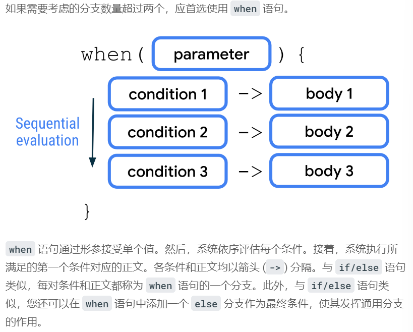

# 2023-2-3

## 第一个程序

```K
fun main() {
    println("Hello, world!")
}
```

这是一个主函数，和`Java`类似，但是简洁许多(最喜欢的部分就是不需要写==;==了,这很`nice`)

## 创建变量

```k
fun main() {
    val count: Int = 2
    println(count)
}
```

设置变量，具体格式为

==val name: data type = initial value==

在`Kotlin`中也是有5种数据类型

输出变量名

```kotlin
fun main() {
    val count: Int = 2
    println("You have $count unread messages.")
}
```

在输出中显示变量的值，需要在变量前面添加一个美元符号==$==

### 类型推断

当你知道初始值的时候，可以不需要写入确切的类型

```k
val count = 2
```

### 基本数学计算

当你在使用字符串模板的时候想要进行运算，那么需要用大括号将表达式括起来，并且在大括号前添加==$==符号

```ko
fun main() {
    val unreadCount = 5
    val readCount = 100
    println("You have ${unreadCount + readCount} total messages in your inbox.")
}
```

### 更新变量

在`Kotlin`中，常量是`val`，变量的关键词其实是`var`，当你想要给一个常量更新值，那么就会抛出编译错误

```kotlin
fun main() {
    var cartTotal = 0
    cartTotal = 20
    println("Total: $cartTotal")
}
```

### 编码规范

- 变量名字应该采用驼峰式大小写形式，并且以小写字母开头
- 在变量声明中指定数据类型是，应该在冒号后面添加一个空格
- 赋值运算符、加号、减号、乘号、除号等运算符的前后应该有空格
- 建议一行不要超过100个字符

### 注释

`Kotlin`中的注释和`Java`别无二致

## 创建和使用Kotlin函数

### 函数的格式

声明（或定义）函数时，需要使用`fun`关键字，并且在大括号内添加代码

```kotlin
fun main() {
    birthdayGreeting()
}

fun birthdayGreeting() {
    println("Happy Birthday, Rover!")
    println("You are now 5 years old!")
}
```

有返回值的时候，要定义返回值的类型


```kotlin
fun birthdayGreeting(): String {
    val nameGreeting = "Happy Birthday, Rover!"
    val ageGreeting = "You are now 5 years old!"
    return "$nameGreeting\n$ageGreeting"
}

fun main() {
    val greeting = birthdayGreeting()
    println(greeting)
}
```

### 默认实参

```kotlin
fun birthdayGreeting(name: String = "Rover", age: Int): String {
    return "Happy Birthday, $name! You are now $age years old!"
}
```

## 控制语句

```kotlin
fun main() {
    val trafficLightColor = "Black"

    if (trafficLightColor == "Red") {
        println("Stop")
    } else if (trafficLightColor == "Yellow") {
        println("Slow")
    } else if (trafficLightColor == "Green") {
        println("Go")
    } else {
        println("Invalid traffic-light color")
    }

}
```

### 使用when语句处理多个分支



```kotlin
fun main() {
    val trafficLightColor = "Amber"

    val message = when(trafficLightColor) {
        "Red" -> "Stop"
        "Yellow", "Amber" -> "Proceed with caution."
        "Green" -> "Go"
        else -> "Invalid traffic-light color"
    }
    println(message)
}
```

## null性质

### 使用可为null的变量

1. 关键词为`var`
2. 要在数据类型之后添加一个问号（==？==）

```kotlin
fun main() {
    var favoriteActor: String? = "Sandra Oh"
    println(favoriteActor)

    favoriteActor = null
    println(favoriteActor)
}
```

结果：

```shell
Sandra Oh
null
```

### 处理可为null的变量

- 当你想访问可为null的变量的属性

举个例子：

```kotlin
fun main() {
    var favoriteActor: String? = "Sandra Oh"
    println(favoriteActor.length)
}
```

==！==

这个时候就会报错（编译错误）

kotlin会保证null安全，当一个变量有可能是null时，那么，在应用运行期间尝试访问null变量的成员（称为null引用），应用会因为null变量不含任何属性或者方法而崩溃，这类的崩溃称之为“运行是错误”，就是在代码完成编译和运行之后发生的错误。

kotlin具有null安全特性，因此kotlin编译器会对null类型强制执行null检查，以免发生这种错误，所以编译器会出现编译错误。

解决办法：

#### 使用？.安全调用运算符

将`.`运算符替换成`?.`运算符

```kotlin
fun main() {
    var favoriteActor: String? = null
    println(favoriteActor?.length)
}
```

#### 使用!!非null断言运算符

可以使用`!!`非null断言运算符来访问可为null变量的方法和属性

使用这个之后，只有这个变量始终不为null或者设置了异常处理时，才应该使用这断言运算符

不然会抛出运行错误

```kotlin
fun main() {
    var favoriteActor: String? = null
    println(favoriteActor!!.length)
}
```

这个时候，系统会报出==NullPointerException==错误

#### 使用if/else条件语句

在条件语句中使用`if`分支来执行null检查

#### 使用?:Elvis运算符


如果该变量不为`null`，则执行`?:`之前的表达式，要是变量为`null`那么就执行`?:`之后的表达式

```kotlin
fun main() {
    val favoriteActor: String? = "Sandra Oh"

    val lengthOfName = favoriteActor?.length ?: 0

    println("The number of characters in your favorite actor's name is $lengthOfName.")
}
```

## 类和对象

### 定义类

```kotlin
class name {
    body
}
```

类有三个部分组成

- ==属性==：用于指定对象属性的变量
- ==方法==： 包含类的行为和操作的函数
- ==构造函数==： 一种特殊的成员函数，用于在定义类的整个程序中构建类的实例

这是一个简单的类

```kotlin
class SmartDevice {
    // empty body
}

fun main() {
}
```

### 实例化一个类

实例化语句是以类名称开头，后面跟一对圆括号

```kotlin
fun main() {
    val smartTvDevice = SmartDevice()
}
```

### 定义类方法

定义类方法和函数的语法一样

使用`fun`关键字

```kotlin
class SmartDevice {

    fun turnOn(){
        println("Smart device is turned on.")
    }

    fun turnOff(){
        println("Smart device is turned off.")
    }
}
```

在类的外部调用类方法，使用`.`运算符

```kotlin
fun main() {
    val smartTvDevice = SmartDevice()
    smartTvDevice.turnOn()
    smartTvDevice.turnOff()
}
```

### 定义类属性

方法用于定义类可执行的操作，而属性用于定义类的特性或者数据属性

从根本上来讲，属性是在类主体中定义的变量，所以语法规则差不多

```kotlin
class SmartDevice {

    val name = "Android TV"
    val category = "Entertainment"
    var deviceStatus = "online"

    fun turnOn(){
        println("Smart device is turned on.")
    }

    fun turnOff(){
        println("Smart device is turned off.")
    }
}
```

- 属性中的getter和setter函数

定义可变属性的完整语法是以变量定义开头，后跟可选的`get()`和`set()`函数。


确保`speakerVolume`属性的值介于0到100之间

```kotlin
var speakerVolume = 2
    set(value) {
        if (value in 0..100) {
            field = value
        }
    }
```

==注意==：

0..100可以表示0到100之间

### 定义构造函数

主要用途是指定类对象的创建方式

Kotlin中的构造函数主要有两类：

- **主要构造函数**：一个类只能有一个主要构造函数（在类标头中定义）。主要构造函数可以是默认构造函数，也可以是形参化构造函数。主要构造函数没有主体，表示其中不能包含任何代码。
- **辅助构造函数**：一个类可以有多个辅助构造函数。可以定义包含形参或者不含形参的辅助构造函数。辅助构造函数可以初始化类，具有包含初始化逻辑的主体。如果类有主要构造函数，则每个辅助构造函数都需要初始化该主要构造函数。

==主要构造函数的完整语法==:


辅助构造函数包含在类的主体中

语法结构:

- **辅助构造函数声明**：辅助构造函数定义以`constructor`关键字开头，后面跟圆括号。
- **主要构造函数初始化**：初始化以冒号开头，后面依次跟`this`关键字和一对圆括号。
- **辅助构造函数主体**：在主要构造函数的初始化后跟一对大括号，其中包含辅助构造函数的主体

==辅助构造函数完整语法==:


例子：

表示设备状态

```kotlin
class SmartDevice(val name: String, val category: String) {
    var deviceStatus = "online"

    constructor(name: String, category: String, statusCode: Int) : this(name, category) {
        deviceStatus = when (statusCode) {
            0 -> "offline"
            1 -> "online"
            else -> "unknown"
        }
    }
    ...
}
```

实例：

定义一个person类，包含两个可变变量lastName和no，lastName修改了getter方法，no修改了setter方法。

```kotlin
class Person {

    var lastName: String = "zhang"
        get() = field.toUpperCase()   // 将变量赋值后转换为大写
        set

    var no: Int = 100
        get() = field                // 后端变量
        set(value) {
            if (value < 10) {       // 如果传入的值小于 10 返回该值
                field = value
            } else {
                field = -1         // 如果传入的值大于等于 10 返回 -1
            }
        }

    var heiht: Float = 145.4f
        private set
}

// 测试
fun main(args: Array<String>) {
    var person: Person = Person()

    person.lastName = "wang"

    println("lastName:${person.lastName}")

    person.no = 9
    println("no:${person.no}")

    person.no = 20
    println("no:${person.no}")

}
```

输出结果为：

```shell
lastName:WANG
no:9
no:-1
```

==例子(主构造函数)：==

```kotlin
fun main() {
    println("Hello World!")
    val H = Human("男")
    val P = Person("mark")
    P.eat("mark")
    H.s("男")
}

class Person constructor(name: String) {
    val n = name

    init {
        println(name)
    }

    fun eat(name: String) {
        println("我是${name}")
    }
}

class Human(val sex: String) {
    fun s(sex: String) {
        println("我的性别是${sex}")
    }
}
```

输出：

```shell
Hello World!
mark
我是mark
我的性别是男
```

==例子（次构造函数）：==

```kotlin
fun main() {
    println("Hello World!")
    val H = Human("男")
    val P = Person("mark", 1000)
    P.eat("mark")
    H.s("男")
}

class Person constructor(name: String) {
    val n = name

    init {
        println(name)
    }

    fun eat(name: String) {
        println("我是${name}")
    }

    // 次构造函数
    constructor (name: String, alexa: Int) : this(name) {
        println("Alexa 排名 $alexa")
    }
}

class Human(val sex: String) {
    fun s(sex: String) {
        println("我的性别是${sex}")
    }
}
```

结果：

```shell
Hello World!
mark
Alexa 排名 1000
我是mark
我的性别是男
```

### 类之间的关系

- **继承**

1. 在`SmartDevice`父类中的`class`关键字前，添加`open`关键字：

```kotlin
open class SmartDevice(val name: String, val category: String) {
    ...
}
```

`open`关键字告知编译器此类可供拓展

语法规则:


2. 

```kotlin
class SmartTvDevice(deviceName: String, deviceCategory: String) :
    SmartDevice(name = deviceName, category = deviceCategory) {
}
```

3. 添加属性

```kotlin
class SmartTvDevice(deviceName: String, deviceCategory: String) :
    SmartDevice(name = deviceName, category = deviceCategory) {

    var speakerVolume = 2
        set(value) {
            if (value in 0..100) {
                field = value
            }
        }
}
```

- 同等类之间的关系

1. 新建一个新的类

```kotlin
class SmartLightDevice(deviceName: String, deviceCategory: String) :
    SmartDevice(name = deviceName, category = deviceCategory) {

...

}

class SmartHome {
}

fun main() {
...
}
```

2. 在新建的类中，使用`val`关键字创建`SmartTvDevice`类型的`smartTvDevice`属性：

```kotlin
class SmartHome(val smartTvDevice: SmartTvDevice) {

}
```

3. 创建方法

```kotlin
class SmartHome(val smartTvDevice: SmartTvDevice) {

    fun turnOnTv() {
        smartTvDevice.turnOn()
    }

    fun turnOffTv() {
        smartTvDevice.turnOff()
    }

    fun increaseTvVolume() {
        smartTvDevice.increaseSpeakerVolume()
    }

    fun changeTvChannelToNext() {
        smartTvDevice.nextChannel()
    }
}
```

4. 新建一个属性，并且新建新的方法

```kotlin
class SmartHome(
    val smartTvDevice: SmartTvDevice,
    val smartLightDevice: SmartLightDevice
) {

    ...

    fun changeTvChannelToNext() {
        smartTvDevice.nextChannel()
    }

    fun turnOnLight() {
        smartLightDevice.turnOn()
    }

    fun turnOffLight() {
        smartLightDevice.turnOff()
    }

    fun increaseLightBrightness() {
        smartLightDevice.increaseBrightness()
    }
}
```

- 替换子类中的父类方法

1. 在父类的方法中添加`open`关键字(父类也要是有`open`关键字噢)

```kotlin
open class SmartDevice {
    ...
    var deviceStatus = "online"

    open fun turnOn() {
        // function body
    }

    open fun turnOff() {
        // function body
    }
```

2. 在子类的方法前，添加`override`关键字

```kotlin
class SmartLightDevice(name: String, category: String) :
    SmartDevice(name = name, category = category) {

    var brightnessLevel = 0

    override fun turnOn() {
        deviceStatus = "on"
        brightnessLevel = 2
        println("$name turned on. The brightness level is $brightnessLevel.")
    }

    override fun turnOff() {
        deviceStatus = "off"
        brightnessLevel = 0
        println("Smart Light turned off")
    }

    fun increaseBrightness() {
        brightnessLevel++
    }
}
```

`override` 关键字会告知 Kotlin 运行时去执行子类所定义方法中包含的代码

==使用**super**关键字在子类中重复使用父类代码==

在 `SmartTvDevice` 和 `SmartLightDevice` 子类中，使用 `super` 关键字从 `SmartDevice` 类中调用方法：

```kotlin
class SmartTvDevice(name: String, category: String) :
    SmartDevice(name = name, category = category) {

    var speakerVolume = 2
        set(value) {
            if (value in 0..100) {
                field = value
            }
        }
     
    override fun turnOn() {
        super.turnOn()
        println("Smart TV turned on. Speaker volume set to $speakerVolume.")
    }

    override fun turnOff() {
        super.turnOff()
        println("Smart TV turned off")
    }
}
```

- 替换子类中的父类属性

  （与替换方法类似）

1. 

```kotlin
open class SmartDevice(val name: String, val category: String) {
    var deviceStatus = "online"

    open val deviceType = "unknown"
    ...
}
```

2. 

```kotlin
class SmartTvDevice(deviceName: String, deviceCategory: String) :
    SmartDevice(name = deviceName, category = deviceCategory) {

    ...
    override val deviceType = "Smart TV"
    ...
}
```

### 可见性修饰符

作用：

- 可以在**类**中隐藏自己的属性和方法，防止在**类外**未经授权的访问
- 可以在**软件包**中隐藏类和接口，防止在**软件包外**未经授权的访问

有四种可见性修饰符

- `public`：默认的可见性修饰符。可让系统在任何位置访问声明。对于您想在类外部使用的属性和方法，请标记为 public。
- `private`：可让系统在相同类或源文件中访问声明。
- `protected`：可让系统在子类中访问声明。对于您想在定义它们的类及其子类中使用的属性和方法，请使用 `protected` 可见性修饰符进行标记。
- `internal`：可让系统在相同模块中访问声明。internal 修饰符与 private 类似，但您可以从类的外部访问内部属性和方法，只要是在相同类中进行访问即可。

**完整语法:**


一览表：


### 定义属性委托

[委托模式](https://www.runoob.com/w3cnote/delegate-mode.html)是软件设计模式中的一项基本技巧。在委托模式中，有两个对象参与处理同一个请求，接受请求的对象将请求委托给另一个对象来处理。

Kotlin 直接支持委托模式，更加优雅，简洁。Kotlin 通过关键字 by 实现委托。

创建属性委托的语法是以变量声明开头，后面依次跟 `by` 关键字以及用于为属性处理 setter 和 getter 函数的委托对象。


==接口可以帮你实现抽象==

**接口**的完整语法：


## 接口

接口是一种抽象

- 接口使用方： 对外界**依赖**的抽象，表明其依赖哪些能力
- 接口实现方： 对自我**能力**的抽象， 宣称其具备哪些能力

### 意义

- 简洁、易维护
- 解耦
- 分工协作
- 可测性更好
- 拥抱变化

正如上文所说

使用interface关键字定义接口

```kotlin
interface MyInterface {
    fun bar()    // 未实现
    fun foo() {  //已实现
      // 可选的方法体
      println("foo")
    }
}
```

**实现接口**

一个类或者对象可以实现一个或者多个接口

```kotlin
class Child : MyInterface {
    override fun bar() {
        // 方法体
    }
}
```

接口中的属性是抽象的，不允许初始化值，接口不会保存属性值，实现接口时，必须要重写属性

```kotlin
interface MyInterface{
    var name:String //name 属性, 抽象的
}
 
class MyImpl:MyInterface{
    override var name: String = "runoob" //重写属性
}
```

**实例：**

```kotlin
interface MyInterface {
    var name:String //name 属性, 抽象的
    fun bar()
    fun foo() {
        // 可选的方法体
        println("foo")
    }
}
class Child : MyInterface {
    override var name: String = "runoob" //重写属性
    override fun bar() {
        // 方法体
        println("bar")
    }
}
fun main(args: Array<String>) {
    val c =  Child()
    c.foo();
    c.bar();
    println(c.name)
 
}
```

### 函数重写

实现多个接口时，可能会遇到同一个方法继承多个实现的问题

```kotlin
interface A {
    fun foo() { print("A") }   // 已实现
    fun bar()                  // 未实现，没有方法体，是抽象的
}
 
interface B {
    fun foo() { print("B") }   // 已实现
    fun bar() { print("bar") } // 已实现
}
 
class C : A {
    override fun bar() { print("bar") }   // 重写
}
 
class D : A, B {
    override fun foo() {
        super<A>.foo()
        super<B>.foo()
    }
 
    override fun bar() {
        super<B>.bar()
    }
}
 
fun main(args: Array<String>) {
    val d =  D()
    d.foo();
    d.bar();
}
```

A是一个接口，foo是一个已经实现的方法，bar是一个抽象的方法

B是一个接口，两个都是已经实现的方法

C重写了A接口的bar方法

D继承了A和B两个接口，重写了A和B两个接口中的foo方法，重写了B接口的bar方法

输出结果为： ==ABbar==

可以看到，C类中重写的方法，对于接口没有影响

## 函数类型和lambda表达式

### 将函数存储在变量中

```kotlin
fun main() {
    val trickFunction = trick
    trick()
    trickFunction()
}

val trick = {
    println("No treats!")
}
```

### 将函数用作数据类型

在trick()后面指定数据类型即可

```kotlin
val treat: () -> Unit = {
    println("Have a treat!")
}
```

- 将函数用作返回值类型（类似递归）


```kotlin
fun main() {
    val treatFunction = trickOrTreat(false)
    val trickFunction = trickOrTreat(true)
    treatFunction()
    trickFunction()
}

fun trickOrTreat(isTrick: Boolean): () -> Unit {
    if (isTrick) {
        return trick
    } else {
        return treat
    }
}

val trick = {
    println("No treats!")
}

val treat = {
    println("Have a treat!")
}
```

- 将函数作为参数传递到另一个函数

```kotlin
fun trickOrTreat(isTrick: Boolean, extraTreat: (Int) -> String): () -> Unit {
    if (isTrick) {
        return trick
    } else {
        println(extraTreat(5))
        return treat
    }
}
```

- 可为null的函数类型

在圆括号括住数据类型，后接`?`符号

```kotlin
fun trickOrTreat(isTrick: Boolean, extraTreat: ((Int) -> String)?): () -> Unit {
```

### lambda表达式

- 省略参数名称

如果函数只有一个参数，而您未提供名称，Kotlin 会隐式为其分配 `it` 名称，因此您可以省略参数名称和 `->` 符号，从而使 lambda 表达式变得更简洁

修改前：

```kotlin
val coins: (Int) -> String = { quantity ->
        "$quantity quarters"
    }
```

修改后：

```kotlin
val coins: (Int) -> String = {
    "$it quarters"
}
```

- 将lambda表达式直接传入函数

修改前：

```kotlin
fun main() {
    val coins: (Int) -> String = {
        "$it quarters"
    }
    val treatFunction = trickOrTreat(false, coins)
    val trickFunction = trickOrTreat(true, null)
    treatFunction()
    trickFunction()
}
```

修改后：

```kotlin
fun main() {
    val treatFunction = trickOrTreat(false, { "$it quarters" })
    val trickFunction = trickOrTreat(true, null)
    treatFunction()
    trickFunction()
}
```

- 使用尾随lambda语法

语法图示:


示例：

```kotlin
val treatFunction = trickOrTreat(false) { "$it quarters" }
```

### 使用repeat()函数

如果一个函数会返回或者接受另一个函数作为实参，该函数就称为高阶函数

`repeat()`函数是一种高阶函数，是`for`循环的简洁方式

函数签名：

```kotlin
repeat(times: Int, action: (Int) -> Unit)
```

语法：


`times` 参数是操作应发生的次数。`action` 参数是一个函数，它接受单个 `Int` 参数并返回 `Unit` 类型的函数

例子：

```kotlin
fun main() {
    val treatFunction = trickOrTreat(false) { "$it quarters" }
    val trickFunction = trickOrTreat(true, null)
    repeat(4) {
        treatFunction()
    }
    trickFunction()
}
```

输出结果：

`"Have a treat"`字符应该输出4次

```shell
5 quarters
Have a treat!
Have a treat!
Have a treat!
Have a treat!
No treats!
```

