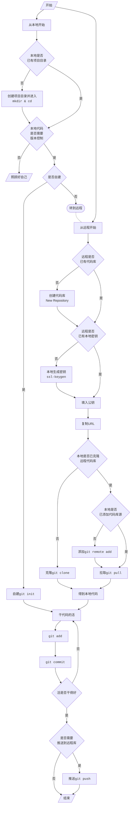

# Git 工作

```mermaid
graph TD
Start[/开始/]
local[从本地开始]
remote[从远程开始]

a{本地是否<br>已有项目目录}
a1[创建项目目录并进入<br><code>mkdir & cd</code>]
b{本地代码<br>是否需要<br>版本控制}
b1[/照顾好自己/]
c{是否自建}
c1[自建<code>git init</code>]
c2([转到远程])
w1[干代码的活]
w2[<code>git add</code>]
w3[<code>git commit</code>]
w4{活是否干得好}

A{远程是否<br>已有代码库}
A1[创建代码库<br>New Repository]
B{远程是否<br>已有本地密钥}
B1[本地生成密钥<br><code>ssl-keygen</code]
C[填入公钥]
D[复制URL]
E{本地是否已克隆<br>远程代码库}
E1[克隆<code>git clone</code>]
F{本地是否<br>已添加代码库源}
F1[添加<code>git remote add</code>]
F2[拉取<code>git pull</code>]
G[得到本地代码]

p{是否需要<br>推送到远程库}
End[/结束/]
p1[推送<code>git push</code>]

Start --> local & remote
local --> a --> |否|a1 --> b
a --> |是|b
b --> |否|b1
b --> |是|c
c --> |是|c1
c --> |否|c2
c1 --> w1 --> w2 --> w3 --> w4 --> |否|w1
c2 -.- remote

remote --> A
A --> |否|A1
A --> |是|B
A1 --> B
B --> |否|B1
B --> |是|C
B1 --> C --> D --> E
E --> |否|E1
E --> |是|F
F --> |否|F1
F --> |是|F2
F1 --> F2 --> G
E1 --> G

G --> w1
w4 --> |是|p

p --> |否|End
p --> |是|p1
p1 --> End
```

