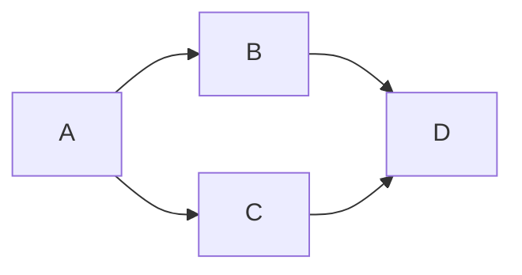
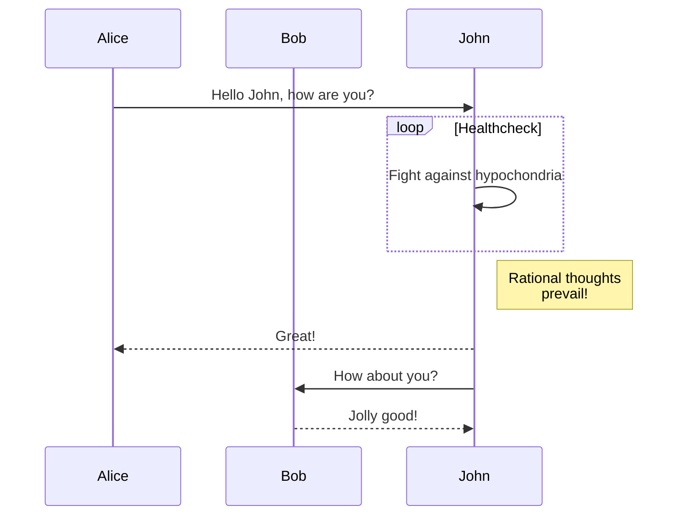
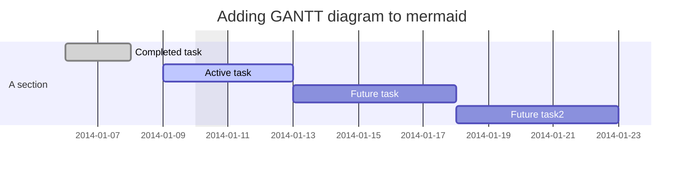
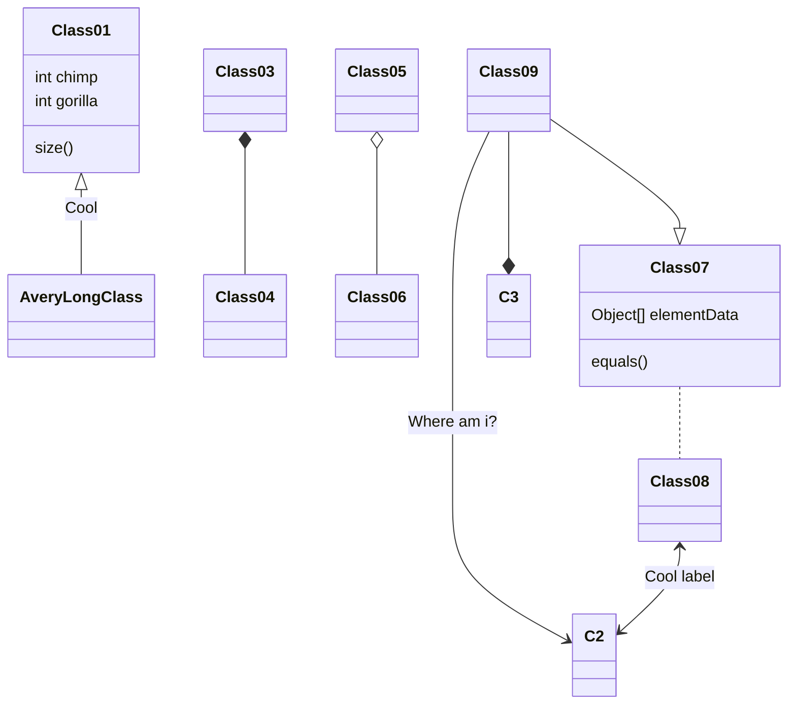
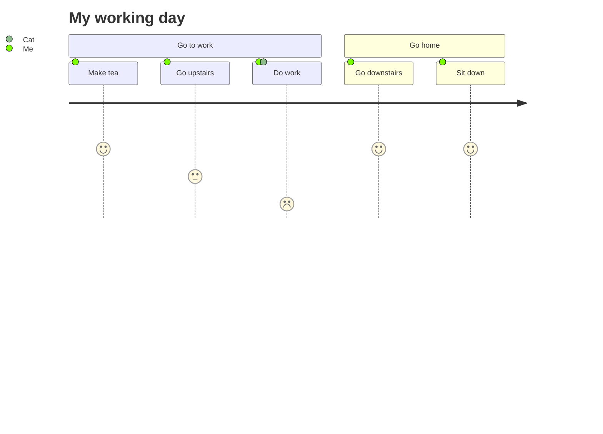

# Mermaid画图

[https://mermaidjs.github.io](https://mermaidjs.github.io/demos.html)

## 流程图



## 方向和箭头含义

TB 上下

BT 下上

RL 左右

LR 右左

添加尾部箭头 >

不添加尾部箭头 -

单线 --

单线加文字 --text--

粗线 ==

粗线加文字 ==text==

虚线 -.-

虚线加文字 -.text.-

## 节点含义

默认方形

id1[dang xing ]

id2(yuan xing ju xing)

id3([ti yu chang xing])

id4[[zi cheng xu xing]]

id5[(yuan zhu xing)]

id6((yuan xing))

id1{ling xing}

## 时序图



## 甘特图



## class diagram 类图



## git graph 吉特图

```mermaid

```

## 实体关系图

```mermaid
erDiagram
    CUSTOMER ||--o{ ORDER : places
    ORDER ||--|{ LINE-ITEM : contains
    CUSTOMER }|..|{ DELIVERY-ADDRESS : uses
```

## 用户旅程图


